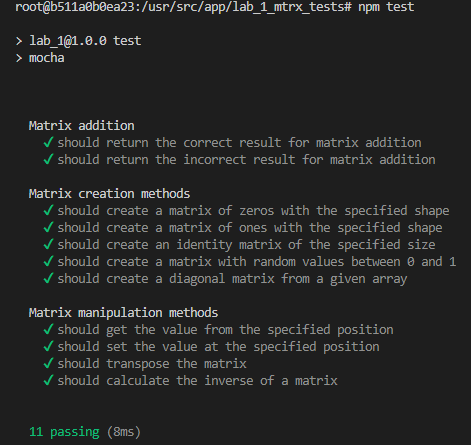
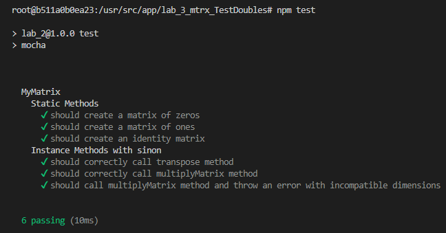

# Educational project for the course on automated testing

## How it works?

To run the tests, you need to go to the directory of the corresponding `lab_...` folder and run:  
 `npm install`  
  After the packages are installed, you can start the tests with the command:  
 `npm test`
  
    
  
# Results:

## Lab 1

  
## Lab 2

  
## Lab 3

