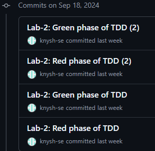

## 
The commit history shows that I alternated between 'red' and 'green' phases, where I first wrote the tests and then the code to pass those tests, following the Test-Driven Development (TDD) approach.

# Results:

