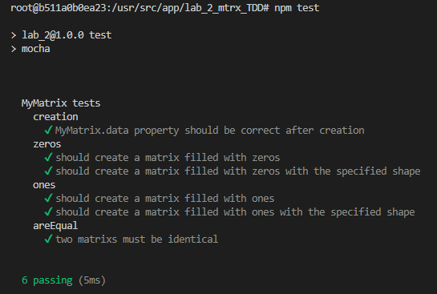

# Контрольні запитання
1. **Особливості підходу TDD (Розробка через тестування):**

   - **Тестування перед кодом**: У TDD спочатку пишуться автоматизовані тести, які визначають бажану функціональність або покращення, а вже потім пишеться код, який проходить ці тести.
   - **Короткі цикли розробки**: Процес складається з швидких ітерацій, що включають написання тесту, реалізацію коду та рефакторинг.
   - **Рефакторинг**: Після проходження тесту код оптимізується для поліпшення його структури та підтримуваності без зміни зовнішньої поведінки.
   - **Покращений дизайн**: Підхід сприяє обдуманому проектуванню, оскільки розробник має чітко визначити вимоги перед реалізацією.
   - **Тести як документація**: Тести слугують живою документацією, яка описує функціональність системи та її очікувану поведінку.

2. **Використання модульного тестування в методології TDD:**

   - **Основний інструмент TDD**: Модульне тестування є серцем TDD, оскільки воно дозволяє тестувати окремі компоненти в ізоляції.
   - **Процес "Червоний-Зелений-Рефакторинг"**:
     - **Червоний (Red)**: Написання модульного тесту, який спочатку не проходить, оскільки функціональність ще не реалізована.
     - **Зелений (Green)**: Написання мінімального коду, необхідного для проходження тесту.
     - **Рефакторинг (Refactor)**: Оптимізація коду, збереження його працездатності та проходження всіх тестів.
   - **Постійна перевірка**: Модульні тести забезпечують негайний зворотний зв'язок про те, чи працює новий код як очікується.

3. **Врахування специфікації програмного забезпечення та на якому етапі:**

   - **На етапі написання тестів**: Специфікація програмного забезпечення враховується під час написання початкових тестів. Розробник повинен чітко розуміти вимоги та очікувану поведінку системи.
   - **Тести як формалізація вимог**: Кожен тест відображає конкретний аспект специфікації, тим самим перетворюючи вимоги в перевіряючі сценарії.
   - **Постійне узгодження з вимогами**: Протягом усього циклу розробки через тестування розробник постійно звіряє реалізацію з специфікацією, забезпечуючи відповідність кінцевого продукту початковим вимогам.

## Пояснення до цієї роботи
Історія комітів показує, що я чергував між фазами «червоний» та «зелений», де спочатку писав тести, а потім код для проходження цих тестів, слідуючи підходу розробки через тестування (TDD).

# Results:

