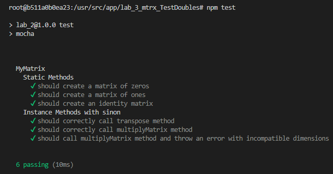

## Контрольні запитання

1. **Приклади використання Fake, Stub, Mock:**

   - **Fake (Фейк):** Це об'єкт або система, яка має робочу реалізацію, але спрощену або не повністю функціональну. Наприклад, замість реальної бази даних для тестування використовують in-memory базу даних, яка імітує поведінку справжньої, але працює швидше і не потребує налаштування.

   - **Stub (Заглушка):** Це об'єкт, який повертає заздалегідь визначені значення, незалежно від вхідних даних. Наприклад, метод `getUser()` завжди повертає одного й того ж користувача, незалежно від того, який ідентифікатор передано.

   - **Mock (Макет):** Це об'єкт, який не лише імітує поведінку реального об'єкта, але й дозволяє перевіряти, як він був використаний. Наприклад, можна перевірити, чи був викликаний метод `sendEmail()` з конкретними параметрами та скільки разів.

2. **Особливості модульного та приймального тестування:**

   - **Модульне тестування:**
     - Тестує окремі модулі або компоненти програми в ізоляції від інших.
     - Дозволяє виявити помилки на ранніх стадіях розробки.
     - Використовує тестові подвійники (Fake, Stub, Mock) для ізоляції від зовнішніх залежностей.
     - Зазвичай виконується розробниками.

   - **Приймальне тестування:**
     - Тестує систему в цілому з точки зору кінцевого користувача або замовника.
     - Перевіряє, чи відповідає система вимогам та очікуванням.
     - Включає реальні дані та сценарії використання.
     - Часто виконується тестувальниками або самим замовником.

3. **Призначення бібліотек Sinon та Sinon-Chai:**

   - **Sinon:** Це бібліотека для JavaScript, яка надає функціональність створення шпигунів (spies), заглушок (stubs) та макетів (mocks). Вона допомагає ізолювати тестований код від зовнішніх залежностей, дозволяючи:
     - Створювати фейкові функції та об'єкти.
     - Перехоплювати та перевіряти виклики функцій, аргументи та контексти.
     - Імітувати часові функції, таймери тощо.

   - **Sinon-Chai:** Це розширення для бібліотеки тверджень Chai, яке інтегрує можливості Sinon з синтаксисом Chai. Воно дозволяє писати більш читабельні та зрозумілі твердження для перевірки поведінки шпигунів, заглушок та макетів. Наприклад:
     ```javascript
     expect(mySpy).to.have.been.calledWith('argument');
     ```

# Result:
  

