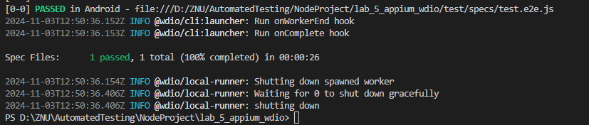

## Налаштування для запуску на macOS або Linux

Якщо потрібно запустити тести на macOS або Linux, зробіть кілька змін у файлі `wdio.conf.js`, щоб адаптувати його для цих систем.

#### 1. Шлях до APK-файлу
На Windows використовуються зворотні слеші (`\`), тоді як на macOS і Linux — прямі (`/`). Змініть шлях до APK-файлу на відповідний формат:

- Було:
    ```javascript
    'appium:app':'app\\android\\ApiDemos-debug.apk'
    ```
- Стало:
    ```javascript
    'appium:app':'app/android/ApiDemos-debug.apk'
    ```

#### 2. Команда запуску Appium
У секції `services` в Windows вказаний шлях `appium.cmd`. На macOS та Linux замініть його на `appium`:

- Було:
    ```javascript
    command: 'node_modules\\.bin\\appium.cmd'
    ```
- Стало:
    ```javascript
    command: 'node_modules/.bin/appium'
    ```

#### 3. Інші параметри в `capabilities`
Перевірте основні параметри, щоб вони відповідали вашому середовищу:
   - **`appium:platformName`**: залиште `'Android'`.
   - **`appium:deviceName`**: задайте назву вашого емулятора або пристрою.
   - **`appium:platformVersion`**: вкажіть версію Android, яка використовується на пристрої або емуляторі.


## Результати виконання тестів:

---


## Контрольні запитання

1. **Наведіть особливості тестування мобільних застосунків.**
    - Тестування мобільних застосунків охоплює різні платформи (наприклад, iOS, Android), що вимагає підтримки кросплатформенних інструментів.
    - Мобільні застосунки можуть бути нативними, гібридними або мобільними веб-застосунками, кожен з яких має свої особливості тестування.
    - Автоматизація мобільних тестів часто потребує доступу до реальних пристроїв або емуляторів/симуляторів для перевірки функціональності.
    - У мобільних тестах важливо враховувати унікальні для мобільних пристроїв атрибути, такі як робота з жестами, орієнтація екрана, обробка дзвінків, робота з різними розмірами екрана та специфічними налаштуваннями пристрою.

2. **Порівняйте такі засоби Appium, WebdriverIO, Selenium, Cypress.**
    - **Appium**: спеціалізується на автоматизації мобільних додатків (iOS, Android), підтримує нативні, гібридні та мобільні веб-додатки. Використовує WebDriver протокол і є незалежним від платформи додатка.
    - **WebdriverIO**: універсальний інструмент для автоматизації тестування, призначений для веб-додатків та мобільних додатків через інтеграцію з Appium. Побудований на JavaScript і добре інтегрується з фреймворками Mocha, Jasmine, Cucumber.
    - **Selenium**: основний інструмент для автоматизації тестування веб-додатків у браузерах. Підтримує кілька мов програмування і може працювати на різних браузерах, але не спеціалізується на мобільних додатках.
    - **Cypress**: сучасний інструмент для тестування веб-додатків, особливо популярний для фронтенд-тестування. Підтримує тільки JavaScript і не підходить для мобільних додатків, фокусується на швидкості та простоті написання тестів для веб-додатків.

3. **Чи можна використовувати іншу бібліотеку для модульного тестування окрім Mocha, при написанні тестів засобами Appium, WebdriverIO?**
    - Так, при написанні тестів з використанням Appium і WebdriverIO можна використовувати інші бібліотеки для модульного тестування, такі як Jasmine або Cucumber. Обидві бібліотеки добре інтегруються з WebdriverIO і пропонують свої особливості, такі як поведінковий підхід до тестування (Cucumber) або альтернативний синтаксис для тестів (Jasmine).