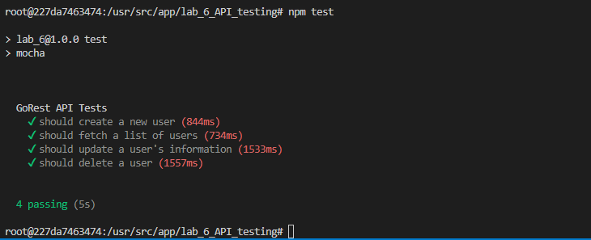

## Лабораторна робота №6. Тестування API

Тут використовується ресурс [GoRest API](https://gorest.co.in/) для демонстрації тестування REST API за допомогою бібліотек Mocha та SuperTest. GoRest API надає публічний доступ до CRUD-операцій над даними користувачів, таких як створення, читання, оновлення та видалення.

### Основні функції GoRest API, що використовуються в тестах

Тести в цієї роботи перевіряють основні методи HTTP для ресурсу користувачів:
- **POST /users** – створення нового користувача
- **GET /users** – отримання списку всіх користувачів
- **PUT /users/{user_id}** – оновлення інформації про користувача за його `id`
- **DELETE /users/{user_id}** – видалення користувача за його `id`
  
---
> **Увага**: API GoRest вимагає аутентифікації через персональний токен доступу (Bearer Token). У даних тестах наразі використовується мій особистий токен, який зашитий у коді. Зверніть увагу, що цей токен може перестати працювати в будь-який момент. Рекомендується отримати власний токен на сайті [GoRest](https://gorest.co.in/) і замінити його в тестах для стабільної роботи.


### Запуск тестів
1. Встановіть залежності:
   ```bash
   npm install
2. Запустіть тести за допомогою Mocha:
    ```bash
    npm test

### Результат роботи


### Контрольні запитання

1. **Наведіть види тестування.**
   У контексті тестування API за допомогою SuperTest можна розглянути наступні види тестування:
   - **Модульне тестування**: перевірка окремих функцій API. Наприклад, перевірка, чи коректно відповідає API на запит `GET /users` або `POST /users`.
   - **Інтеграційне тестування**: перевірка, як різні API-ендпоїнти взаємодіють між собою. Це може включати послідовні запити, де один виклик впливає на інший, наприклад, створення користувача, а потім отримання даних про нього.
   - **Системне тестування**: тестування всієї системи API для перевірки її коректної роботи з різними модулями.
   - **Приймальне тестування**: тестування API з точки зору кінцевого користувача для перевірки, що воно відповідає бізнес-вимогам і специфікаціям.
   - **Регресійне тестування**: повторне тестування API після внесення змін до коду, щоб упевнитися, що існуючий функціонал не порушений.

2. **Особливості модульного та приймального тестування.**
   - **Модульне тестування**: під час тестування API з SuperTest модульні тести дозволяють перевіряти кожен окремий запит та його відповідь. Наприклад, можна протестувати, чи повертає запит до певного ендпоїнту правильний статус-код і структуру відповіді.
   - **Приймальне тестування**: забезпечує перевірку, що API відповідає очікуванням користувача. Наприклад, для GoRest API приймальні тести могли б перевіряти, чи правильно API опрацьовує створення, оновлення та видалення користувачів відповідно до специфікацій.

3. **Призначення бібліотек Mocha та Chai.**
   - **Mocha**: використовується як фреймворк для організації і запуску тестів. У цій лабораторній роботі Mocha керує виконанням тестів для HTTP-запитів, дає можливість групувати тести та встановлювати очікування для кожного виклику.
   - **Chai**: бібліотека для написання асертацій, яка може працювати разом з Mocha для перевірки результатів тестів. Вона надає зручний синтаксис для перевірки відповідності статус-кодів і значень у відповідях API.